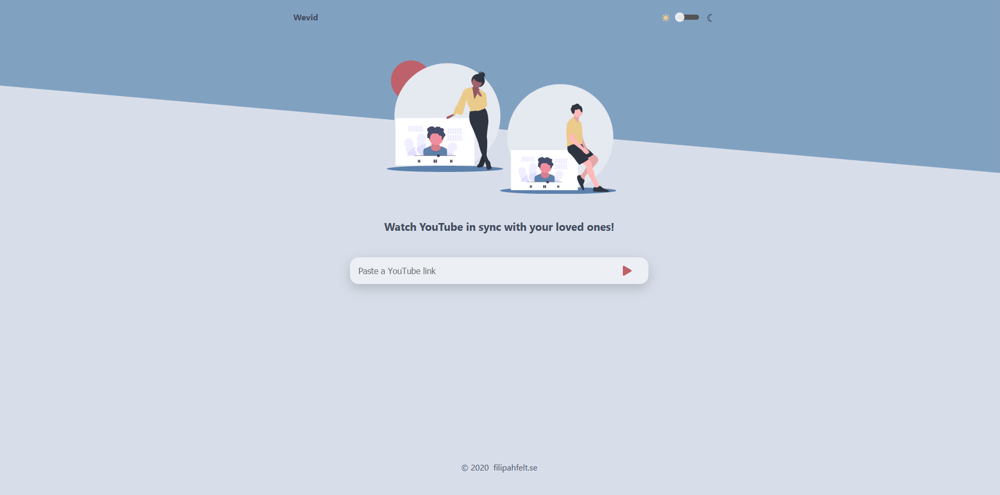

# :sunny: Wevid  - Synchronized YouTube Player built in react

> https://wevid.online/

> Synchronized YouTube player that let friends watch videos together regardless of geograpic location

### Technologies
* React.js
* CSS
* Node.js
* Websockets
* Express

### TODO
- [ ] Auto sync with leader on join
- [x] Update video id without breaking the session

### Setup
`yarn install`

`yarn start`

### Status
Wevid is [live!](https://wevid.online/)

## Contributors

<table>
  <tr>
    <td align="center">
      <a href="https://github.com/Antrikshy">
         <b>Antriksh Yadav</b>
        
      </a>
       
      Update videoID
    </td>
  </tr>
</table>

### Inspiration
Project inspired by [@YasserYka](https://github.com/YasserYka/YT-API).

### Contact
Created by [@filahf](https://www.filipahfelt.se/) - feel free to contact me!
